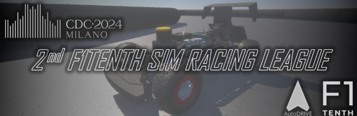

# **F1Tenth Competition Documentation**

---

### About the instructor

👋 Hi! I'm Abdallah Nabil

* 🎓 Computer and Control system Level 300
* 🧠 autonomous member (Control) 23-24
* 🤖 contact me: [LinkedIn](https://www.linkedin.com/in/0xabdallah-nabil/)

## Our Outlines:

* introduction
* About Competition
* Before we start
* explain the algorithm of pure pursuit
* explain the code
* how to run the simulator and the container!
* sources

---

## About Competition:

**F1TENTH Autonomous Racing** is a semi-regular competition organized by an international community of researchers, engineers, and autonomous systems enthusiasts. The teams participating in the **22nd F1TENTH Autonomous Grand Prix** at [CDC 2024](https://cdc2024.ieeecss.org/) will write software for a 1:10 scaled autonomous racecar to fulfill the objectives of the competition => ***drive fast but don’t crash!***

The main focus of the Sim Racing League is a virtual competition with simulated cars and environments, which is accessible to everyone across the globe. For the [CDC 2024](https://cdc2024.ieeecss.org/) competition, each team will be provided with a standardized simulation setup (in the form of a digital twin of the F1TENTH vehicle, and a digital twin of the Porto racetrack) within the high-fidelity [AutoDRIVE Simulator](https://github.com/Tinker-Twins/AutoDRIVE/tree/AutoDRIVE-Simulator). Additionally, teams will also be provided with a working implementation of the [AutoDRIVE Devkit](https://github.com/Tinker-Twins/AutoDRIVE/tree/AutoDRIVE-Devkit) to get started with developing their autonomy algorithms. Teams will have to develop perception, planning, and control algorithms to parse the real-time sensor data streamed from the simulator and generate control commands to be fed back to the simulated vehicle.

The competition will take place in 2 stages:

* **Qualification Race:** Teams will demonstrate their ability to complete multiple laps around the practice track without colliding with the track bounds at run time.
* **Time-Attack Race:** Teams will compete against the clock, on a previously unseen racetrack, to secure a position on the leaderboard.

Since the vehicle, the sensors, the simulator, and the devkit are standardized, teams must develop robust racing algorithms that can deal with the uncertainties of an unseen racetrack.

visit [copmetetion documentation](https://autodrive-ecosystem.github.io/competitions/f1tenth-sim-racing-cdc-2024/#timeline) for more informations.

---

## Before we start:

We must read the  **[Technical Guide](https://autodrive-ecosystem.github.io/competitions/f1tenth-sim-racing-guide/)**  ,This document describes the technical details of the competition framework for the F1TENTH Sim Racing League. It goes over the details pertaining to the simulator and devkit, as well as some important aspects of the submission system, process, and evaluation.

We can also read the [Competition Rules](https://autodrive-ecosystem.github.io/competitions/f1tenth-sim-racing-rules/) ,This document describes the rules and regulations for the F1TENTH Sim Racing League. It goes over the definitions, requirements and evaluation criteria as well as general dos and don'ts for the competition.

We must be familier with [docker and docker hub](https://github.com/MMSAutonomousTeam/learning_inside_team/blob/main/docker/docker.md) ,Docker is an open platform that enables users to develop, ship, and run applications with ease. Docker software is packaged as containers- a docker standardized unit. These containers have all the elements, such as system tools, libraries, runtime, etc required by the software.

finally we must be familiar with [ROS2](https://docs.ros.org/en/foxy/index.html),**The Robot Operating System (ROS) is a set of software libraries and tools for building robot applications.** From drivers and state-of-the-art algorithms to powerful developer tools, ROS has the open source tools you need for your next robotics project.

---

## Explain The Algorithm of Pure Pursuit:

we need to read [PurePursuit](https://github.com/MMSAutonomousTeam/Autonomous-Sessions/blob/main/5.control/Control.md) part in this Documentation. and watch this video explain [PurePursuit]() algorithm.

---

## Explain The Code:

we depend on two important thing in our [Code](https://github.com/MMSAutonomousTeam/F1tenth_purepursuit/blob/main/vehicle_controller/vehicle_controller/purepursuit_controller.py) :

1. to get a path point
2. to apply PurePursuit on this path

### How to get the way point?

---

### **Have Questions? Reach Out!** ✉️

If you have any questions or need further clarification about anything in this documentation, feel free to get in touch. We're here to help you on your journey into the world of autonomous systems!

You can contact us at:

📧 **Email** : [mmsautonomousteam@gmail.com](mailto:mmsautonomousteam@gmail.com)

🌐 **GitHub Discussions** : [github](https://github.com/MMSAutonomousTeam/Autonomous-Sessions/discussions)

We're excited to support you and look forward to your questions! 😊
